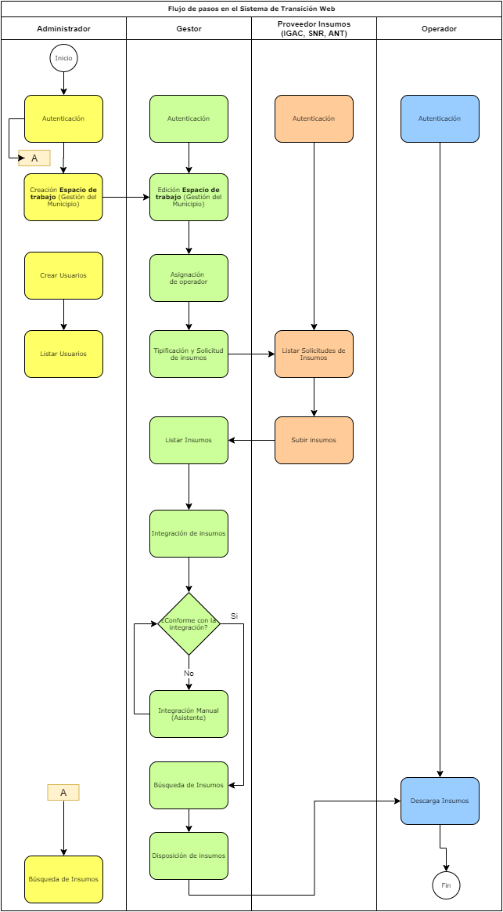

# Descripción del sistema de transición

Para el desarrollo del sistema se contemplan de forma general las actividades que se necesitan para la gestión de información en el marco del barrido predial masivo (bmp) con un alcance acotado hasta el momento de disposición y entrega de los insumos al operador por parte del gestor catastral como se muestra en la imagen; en donde se inicia con la autenticación de cada uno de los perfiles y se termina con la descarga de los insumos por parte del operador a través del sistema. 

<small>Flujo de actividades en el Sistema de Transición</small>
 

En la parte superior de la imagen, se muestran cuatro actores que interactúan en el sistema y que se explicaran cada uno en la siguiente sección; las siguientes actividades que pertenecen a la Fase 1, están programadas en cada uno de los módulos del sistema, para que los usuarios puedan desarrollar las actividades concernientes a proveedor los insumos necesarios para iniciar el proceso de levantamiento catastral en el marco de los barridos prediales y en la Fase 2 las actividades asociadas a la recepción de los productos del BPM.

1. Gestión del municipio (asignación de municipio para BPM y Gestor Catastral).
2. Asignación de operador.
3. Solicitud de insumos.
4. Cargue de insumos.
5. Integración de insumos (integración automática de archivos XTF).
6. Búsqueda de insumos cargados al sistema.
7. Disposición de insumos al operador.
8. Descarga de insumos.
