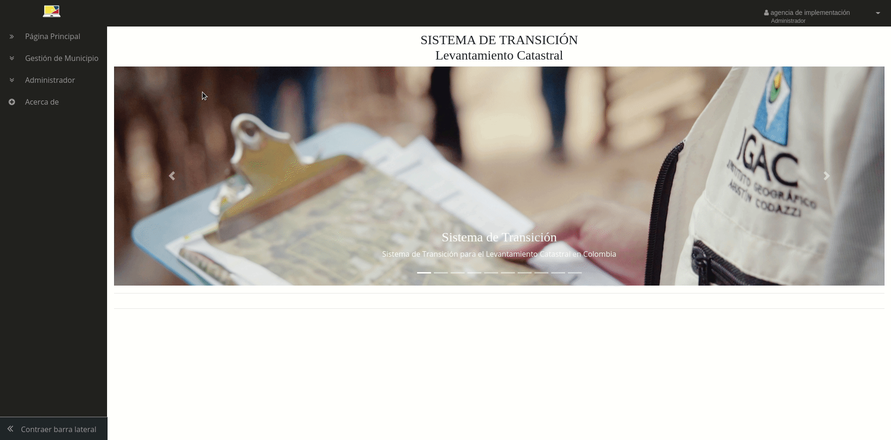
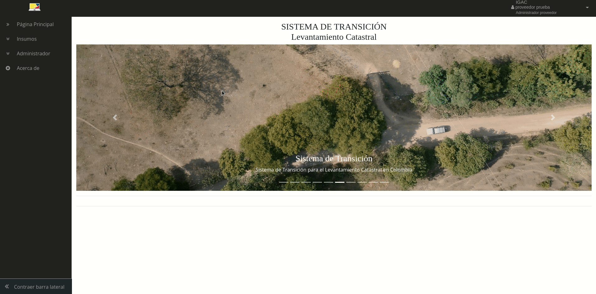
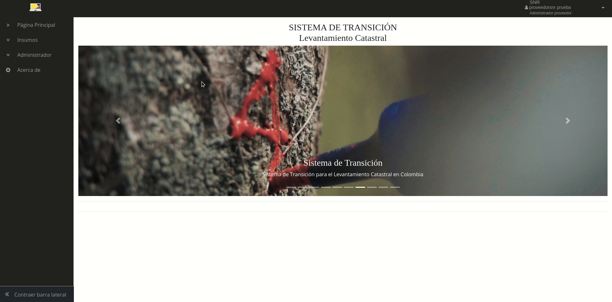
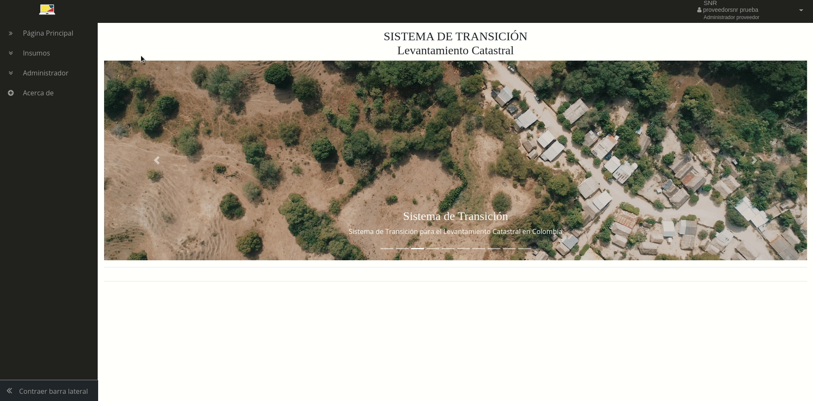
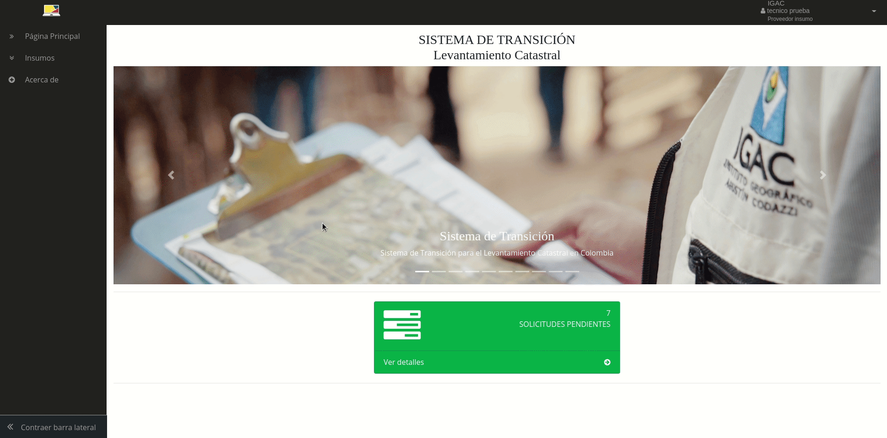
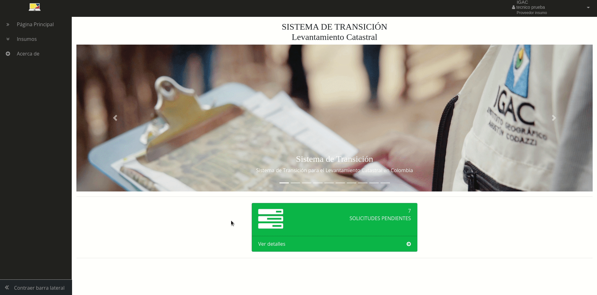
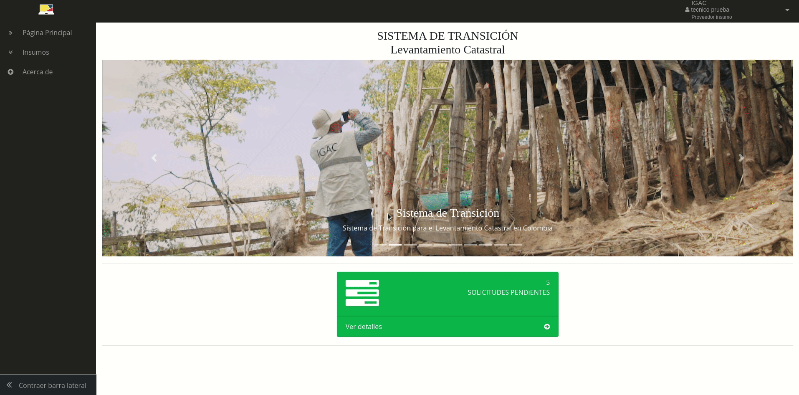
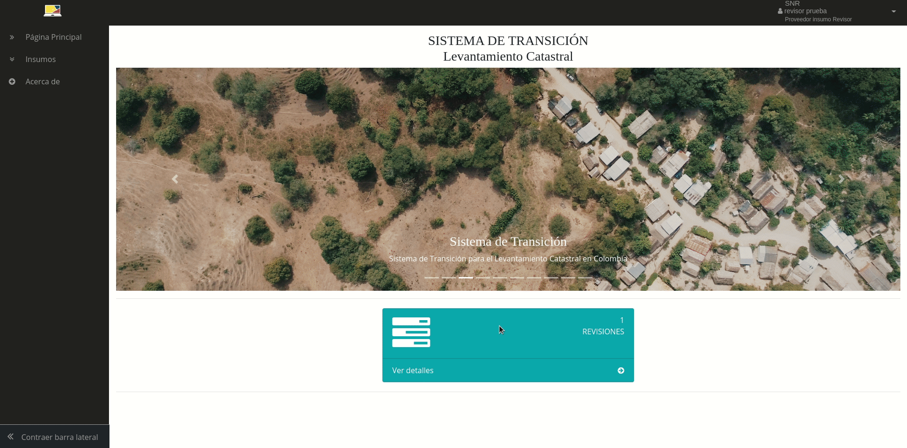

# ROL: PROVEEDOR DE INSUMOS

El rol de Proveedor de Insumos está dispuesto para ser utilizado por las entidades de orden nacional, departamental o municipal que generen insumos necesarios para realizar las actividades de levantamiento catastral, estas entidades son creadas en el Sistema y dependiendo del perfil que se les asigne (Administrador o Técnico) podrán tener a acceso a funcionalidades que les permitirán atender las solicitudes de insumos que se les realicen por parte del rol Gestor.

El rol Proveedor para esta versión del sistema tiene acceso al módulo de Gestión de usuarios y Gestión de Insumos, en donde podrá gestionar la creación de usuarios y áreas de trabajo asociados a su entidad; gestionar el cargue de los insumos que el Gestor le ha solicitado por cada municipio; crear y caracterizar insumos nuevos en el Sistema; atender las peticiones para la caracterización de nuevos insumos.

A continuación, se describen cada uno de los módulos que tiene acceso este rol.
## Gestión de Usuarios (perfil Administrador)

En este módulo el Proveedor de Insumos con perfil administrador puede listar y ver los datos de todos los usuarios asociados a su entidad, también puede registrar nuevos usuarios a través de un formulario y crear áreas de trabajo dentro de su entidad, a continuación, la descripción de estas funcionalidades.
### Listar Usuarios

Se despliega al dar clic en menú lateral izquierdo en la entrada “Administrador/Listar Usuarios” el sistema lista los usuarios registrados para su entidad junto con sus datos como se ve en la imagen, se muestran los siguientes datos: área de trabajo, perfil, usuario, nombres, apellidos, correo asociado, fecha de creación del usuario y tiene disponible las opciones de editar y activar/desactivar el usuario.

### Registrar Usuarios

Se despliega al dar clic en el menú lateral izquierdo en la entrada “Administrador/Registrar Usuarios” en el formulario se diligencian los campos: Nombre, Apellido, nombre de usuario, correo electrónico que se asociara a la cuenta y en donde le llegaran todas las notificaciones del sistema así como la contraseña para ingresar, contraseña y confirmación de contraseña como se muestra en la imagen; en la parte inferior se muestran dos opciones: Técnico y Revisor; se debe escoger dependiendo a que perfil se desee asociar el usuario y para el técnico se debe escoger el área o áreas de trabajo al que se asignará escogiéndolas de la caja de selección.

### Crear Área de Trabajo

Esta funcionalidad le permite al Proveedor de insumos crear áreas de trabajo dentro de su entidad con el fin de organizar el cargue de insumos por temas y asignar usuarios técnicos a cada una de estas áreas, por ejemplo en la entidad IGAC como proveedor de insumos se tienen tres áreas de trabajo: área catastral, área de cartografía, área de agrología y los insumos a entregar se asocian a cada una de estas áreas según su temática en el momento de realizar la caracterización de dicho insumo, con esto se distribuye el trabajo de cargue de forma eficiente y a un usuario técnico solo le llegaran solicitudes del área a la que fue asignado.

Para desplegar esta funcionalidad se da clic en el menú lateral izquierdo en la entrada “Administrador/Crear Área de trabajo” en el formulario como se ve en la imagen, se diligencian los campos: Nombre y Descripción, con esto se da clic en el botón “Crear” y se crea un área de trabajo y queda disponible para asignarle insumos y usuarios técnicos que realizaran el cargue de los insumos solicitados por el Gestor. 

En la parte inferior se verán las áreas de trabajo creadas y en la parte derecha de cada registro se tiene disponible las opciones de editar y eliminar como se ve en las imágenes.

## Gestión de Insumos

En este módulo el Proveedor de insumos con perfil administrador podrá realizar actividades asociadas a la gestión de insumos para ser entregadas al Gestor para el proceso de levantamiento catastral. Entre las funcionalidades que tiene disponibles están la atención de peticiones de creación de insumos, caracterización de insumos, solicitudes pendientes, solicitudes atendidas para la entrega de insumos. A continuación, se describe cada una de estas funcionalidades.
### Atención a peticiones de creación de insumos (perfil Administrador)

El Proveedor recibe peticiones por parte del Gestor para la creación y caracterización de un insumo que no están disponibles en el sistema, esto quiere decir que no se encuentra en el listado de la interfaz de la sección “solicitud de Insumos” del Gestor.

Para desplegar esta funcionalidad se da clic en el menú lateral izquierdo en la entrada “Insumos/Caracterización de Insumos” y se ubica en la pestaña “Peticiones” como se ve en la imagen. Se da clic en el botón “peticiones abiertas” y el Proveedor puede revisar las peticiones y decidir si va o no a caracterizar el nuevo insumo solicitado y en el campo “Opciones” da clic en el icono “Aceptar Petición”, diligencia el campo “Respuesta” en la ventana emergente y da clic en la opción “Si” para que a través de la interfaz se pueda notificar al Gestor su decisión de crearlo o no y explicarle si es el caso que el insumo ya está creado en el Sistema y como solicitarlo, en caso contrario la razón de porque no fue creado. Si decide crearlo pasa a la interfaz de caracterización de insumos para caracterizarlo y disponerlo en el sistema.

       
### Caracterización de insumos (perfil Administrador)

Esta funcionalidad le permite al Proveedor realizar la caracterización de un insumo y crearlo en el sistema para que esté disponible para ser solicitado por el Gestor. Para desplegar esta funcionalidad se da clic en el menú lateral izquierdo en la entrada “Insumos/Caracterización de Insumos” como se ve en la imagen; en esta interfaz se despliega un formulario que cuenta con los siguientes campos par su diligenciamiento: Área se selecciona el área de trabajo al que el insumo pertenece; Nombre del insumo; Formatos del insumo se selecciona de la lista el formato o formatos que tendrá el insumo y que serán validados por el Sistema en el momento del cargue; Otros formatos se activa este campo con el botón ubicado a la derecha y se digita la extensión del formato (en caso de que no exista de la lista de formatos); Descripción se da una breve descripción del insumo con datos importantes como escala, fuentes, aplicación y actualización del mismo; Metadato se selecciona si requiere o no para solicitarlo en el momento del cargue, Modelo se selecciona si requiere o no para el caso de insumos que requieran un modelo para su validación por el Sistema.

Una vez diligenciado el formulario se da clic en el botón “Crear Insumo” y luego se da clic en aceptar al aviso de verificación que se despliega en la pantalla, ya con esto se caracteriza el insumo y aparece en la lista de la parte inferior de la interfaz y está disponible para ser solicitado por el Gestor.

En la parte inferior de la interfaz se muestra una lista con los insumos caracterizados por el Proveedor y asociados a su entidad, en la tabla tiene los datos del insumo y en parte derecha de la tabla tiene disponible tres botones: Editar si se desean actualizar los datos del insumo; Eliminar con el cuál se elimina definitivamente el insumo del sistema, se debe confirmar esta opción en la ventana de confirmación y el insumo no debe estar relacionado en un proceso de solicitud o entrega. Activar/Desactivar con el cuál el Proveedor decide si el insumo estará disponible en el sistema para ser solicitado por el Gestor, si un insumo es desactivado por el Proveedor este ya no estará disponible en la lista de la interfaz sección “solicitud de Insumos” del Gestor, pero si este ya había sido solicitado o está en proceso de cargue, este se le seguirá mostrando a los demás usuarios del Sistema.

### Solicitudes pendientes (perfil Técnico)

Una vez ha ingresado correctamente al Sistema el usuario Proveedor con perfil técnico se le despliega una bandeja de entrada como se ve en la imagen, en donde se le informa el número de solicitudes que tiene en el Sistema, al dar clic en el texto “Ver detalles” o en el icono de flecha se le redirigirá a la entrada de menú “Solicitudes Pendientes” para que el usuario pueda atenderlas y cargar al Sistema los insumos solicitados. Una vez atendida una de las solicitudes el contador de la bandeja de entrada se actualizará y con ello le indicará el total de solicitudes pendientes cada vez que inicie sesión o vaya a la página principal de la interfaz.

Si se desea ingresar directamente, se despliega al dar clic en el menú lateral izquierdo en la entrada “Insumos/Solicitudes Pendientes” y la interfaz como se ve en la imagen, se cargará una lista con las solicitudes de insumos por atender con los siguientes campos: Número de solicitud, Departamento, Municipio, Gestor que solicita, Fecha de Solicitud, Fecha Límite para cargar los insumos solicitados. En la parte superior se cuenta con un buscador para ayudar al usuario a filtrar la solicitud de su interés.

Para ingresar a cada una de las solicitudes el usuario da clic en el botón “Ver” en la parte derecha del registro e ingresa a la interfaz como se ve en la imagen en donde vera el insumo o insumos (si son de la misma área de trabajo) solicitados para un municipio especifico con los siguientes campos de información: Departamento, Municipio, Gestor, Número de Solicitud, Fecha de Solicitud, Fecha Límite y debajo de cada registro la Observación que envía el Gestor. Utilizando la caja de selección “Tipo” (1) el usuario escoge entre las opciones Archivo (carga un archivo en formato ZIP), URL (se proporciona una URL donde se dispone del insumo) y No Disponible (si no se cuenta con el insumo). Luego de seleccionar la opción Archivo se activa la caja (2) donde se hará el cargue del insumo en formato de compresión “Zip” y se diligencia el campo observación (3) que es obligatorio para cada uno de los registros, después de esto el botón “Enviar” se le habilita (4) para que el usuario de clic y cargue el insumo al Sistema, esto debe hacerse para cada uno de los registros de la solicitud.

En el momento de cargue del insumo el Sistema verifica el formato del archivo a cargar y debe corresponder con el definido en la caracterización del insumo y que su tamaño no supere los 10MB, si el insumo es cargado en formato “Zip” verifica internamente que corresponda con el formato especificado, si no es así le mostrar una advertencia y le pedirá cargarlo de nuevo. Para el caso de los archivos que necesitan validación contra el modelo LADM-COL la interfaz muestra una etiqueta al lado derecho informando su estado “Validando”(5) como se ve en la imagen, el sistema permite que el usuario pueda navegar en otras interfaces y adelante otras tareas mientras valida los archivos y luego pueda volver al registro de cargue de insumos y verificar su resultado; si el insumo no logra ser validado correctamente la etiqueta cambia a estado “Rechazado”(6) y el usuario debe volver a cargar un archivo y esperar a que se valide de nuevo, si la validación es exitosa la etiqueta se actualiza a “Insumo Cargado”(7) y en la parte inferior del registro muestra que usuario realizó el cargue del insumo y luego puede proceder a cerrar la solicitud(8) y con ello realizar la entrega al Gestor .

Cabe notar que los insumos no son entregados ni dispuestos al Gestor si la solicitud no se cierra, ya que el usuario puede salir de esta interfaz y volver a verla en la sección “Solicitudes Pendientes”. El sistema permite que el cargue de los insumos de una misma solicitud pueda realizarse por diferentes usuarios que tengan el mismo perfil y estén asignados a la misma área de trabajo.

A tener en cuenta: Los insumos que se carguen al Sistema de datos catastrales, registrales o ANT en el submodelo de insumos que se almacenan en un formato de intercambio XTF, una vez cargados, se iniciara un proceso de validación contra el modelo LADM-COL para verificar que los datos entregados estén correctos bajo el estándar del modelo, por ello este proceso se ejecuta en segundo plano y puede tardar un tiempo dependiendo del tamaño de los archivos, una vez validado enviara una notificación vía email al usuario para informarle sobre el resultado de la validación.

###  Cargue de insumo Catastral a través de la ETL Cobol-SNC (perfil Técnico)

Para el caso de los insumos solicitados al proveedor de insumo del área de trabajo Catastral (1) como se mostró en la sección “Administración de Usuarios”, se tiene el insumo “Datos catastrales en modelo de insumos” que son los datos catastrales de los predios del municipio que son necesarios entregar al Operador para el inicio de sus actividades de levantamiento Catastral, este insumo a su vez se integra con el de “Datos registrales en modelo de insumos” que provee la SNR desde al área de trabajo OTI (2), y juntos forman parte del modelo de aplicación LADM-COL de levantamiento catastral v1.0. Para ello el proveedor de insumo del área de trabajo catastral que para la mayoría de los municipios del país es el IGAC lo debe generar a partir de sus bases de datos en sistema Cobol y SNC y la SNR de su sistema de información registral.

-- falta imagen

El Sistema permite que después de realizada una solicitud del insumo “Datos catastrales en modelo de insumos” por parte de un Gestor al proveedor de insumos IGAC, el proveedor pueda a través de una función ETL (Extraer, transformar y “Load” Cargar) consultar y extraer los datos de su sistema de información Cobol o SNC con la ayuda del plugin del “Asistente LADM-COL”, estos son extraídos y almacenados en un archivo de intercambio XTF para ser cargados en la interfaz del Sistema de Transición.

El Sistema una vez recibe la solicitud del insumo “Datos catastrales en modelo de insumos” crea una tarea con sus respectivas credenciales para que el usuario con perfil técnico asociado al área de trabajo Catastral del Proveedor IGAC pueda autenticarse desde la interfaz del “Asistente LADM-COL” del programa QGIS (herramienta desktop) como se muestra en la imagen e inicie la ejecución de la función ETL y genera el insumo para ser cargado desde la herramienta desktop o directamente en la interfaz de la solicitud del Sistema de Transición.

Para mayor detalle refiérase a la sección “ETL cobol-SNC” en el Asistente LADM-COL.

### Caso especial SNR (Revisión y cargue de adjuntos PDF “Cabida y Linderos”)

Para el caso de la SNR esta cuenta con dos tipos de usuario: Técnico de la OTI y “Revisor PDF”, esto debido a que el insumo que esta entidad carga “Datos registrales en submodelo de insumos v.1.0” en formato XTF debe ser cargado por el “Técnico” y luego revisado por “Revisor PDF” con el fin de adjuntar todos los documentos de descripción de cabida y linderos de cada registro del archivo XTF. A continuación, se muestra de forma general esta funcionalidad.

### Solicitudes atendidas (perfil Técnico)  

Después de haber cargado los insumos solicitados por parte del Gestor y haber cerrado la solicitud estas pasan a listarse en esta entrada de menú que se despliega al dar clic en el menú lateral izquierdo en la entrada “Insumos/Solicitudes Atendidas” en donde por medio de una lista como se ve en la imagen, se muestran cada una de ellas con los siguientes campos: Número de solicitud, Departamento, Municipio, Gestor, Fecha de solicitud , Fecha Límite y en el icono “ver” al dar clic muestra el detalle de cada una de las solicitudes atendidas. En esta interfaz se tiene un buscador en la parte superior con el fin de ayudar al usuario a encontrar una solicitud de forma más rápida, teniendo en cuenta que en este listado pueden aparecer muchas solicitudes, solo es colocar alguna palabra clave con referencia a la solicitud a buscar y el buscador la filtrara y se la mostrara al usuario.

En esta interfaz se muestra el detalle de una solicitud atendida en donde se listan los insumos entregados con los datos de la solicitud y con los siguientes campos de la entrega: Nombre del insumo entregado, Estado de la entrega, Observación de la entrega, Fecha de cargue del insumo y el nombre del usuario que lo cargo al Sistema. En la parte superior izquierda hay un icono de “volver” con el que el usuario retorna a la lista de solicitudes atendidas.