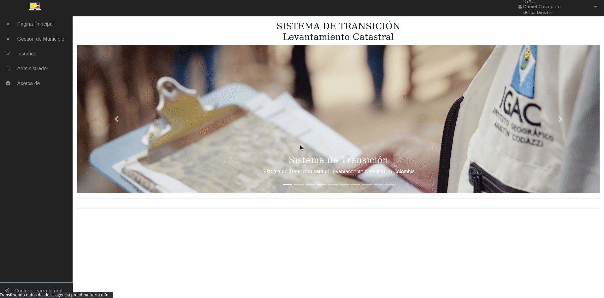
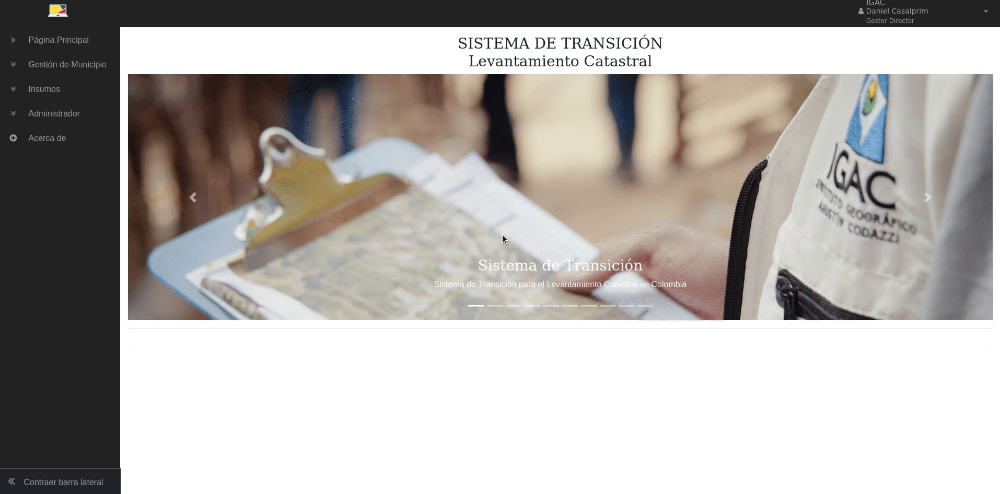
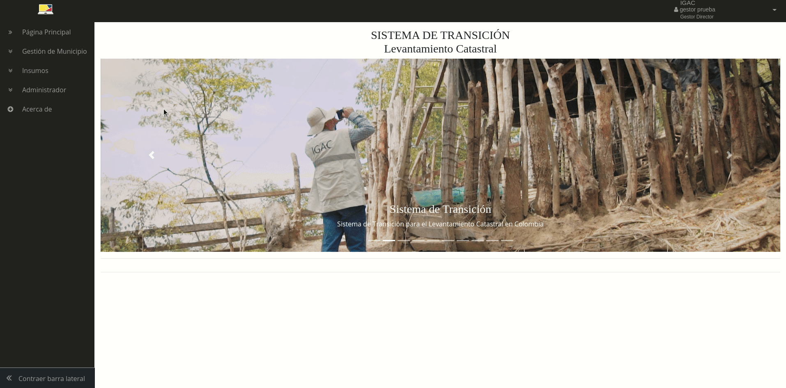
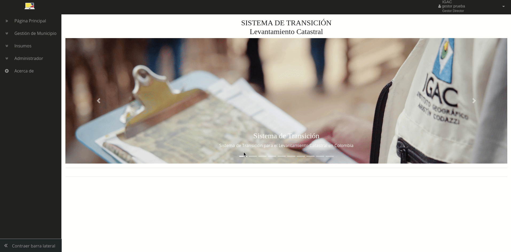
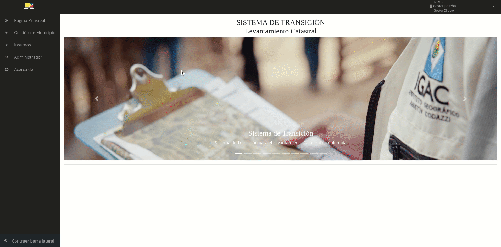
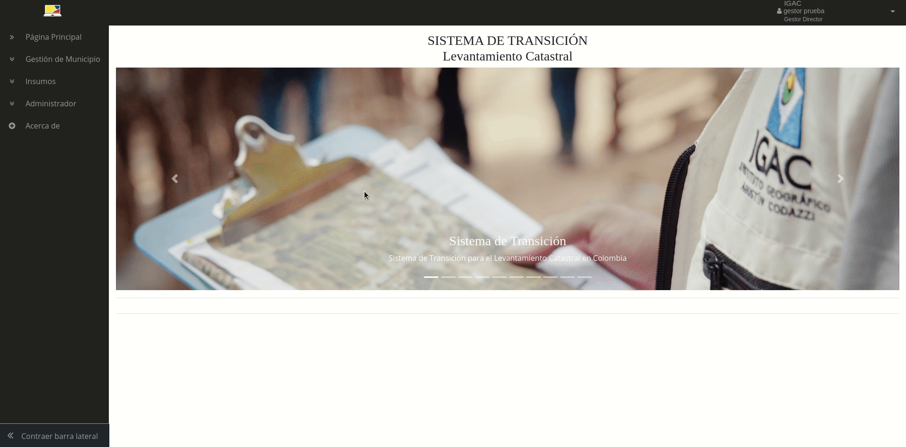
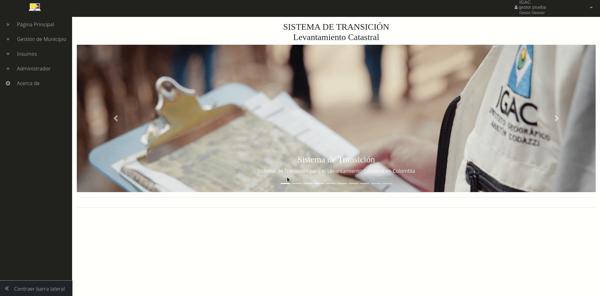
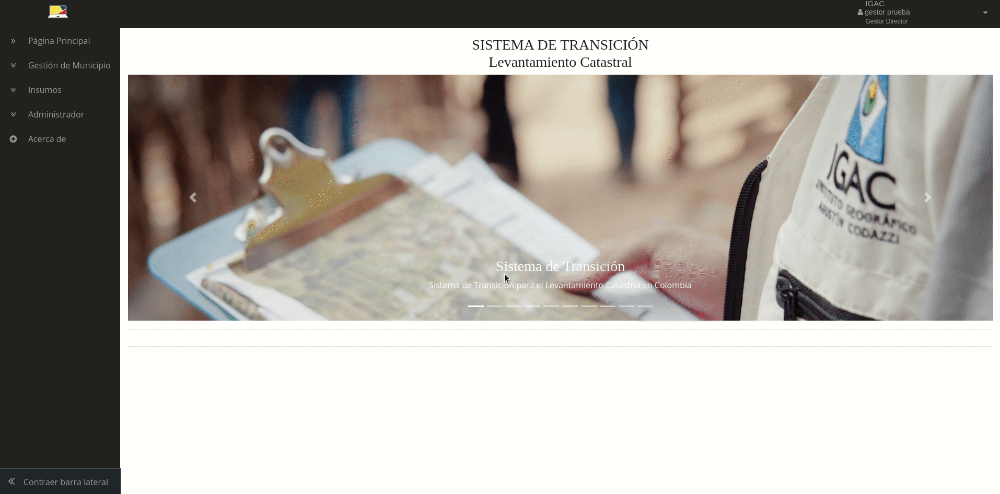

# Rol: Gestor Catastral

El Gestor Catastral es el rol encargado de realizar la gestión catastral de los municipios asignados, asignar los Operadores que realizaran el barrido predial masivo (levantamiento catastral), solicitar insumos a los Proveedores, realizar peticione spara la caracterización de nuevos insumos, crear usuarios de perfil técnico asociados a la entidad del Gestor al que pertenecen.

A continuación, se describen cada uno de los módulos que tiene acceso este rol.

## Gestión de Usuarios

En este módulo el Gestor con perfil administrador puede listar, crear y editar los usuarios de perfil técnico que pertenezcan a la entidad asociada al gestor, estos usuarios pueden realizar tareas de integración asistida y control de calidad sobre los productos recibidos del levantamiento catastral utilizando el **[Asistente LADM-COL](https://swisstierrascolombia.github.io/Asistente-LADM-COL/)**.

### Listar Usuarios

Se despliega al dar clic en menú lateral izquierdo en la entrada "Administrador/Listar Usuarios" y el sistema lista los usuarios registrados a la entidad asociada al Gestor junto con sus datos: perfil, usuario, nombres, apellidos, correo asociado, fecha de creación del usuario y las opciones de editar, activar/desactivar el usuario como se ve en la imagen.

### Registrar Usuarios

Se despliega al dar clic en el menú lateral izquierdo en la entrada "Administrador/Registrar Usuarios" en el formulario se diligencian los campos: Nombres, Apellidos, nombre de usuario, correo electrónico que se asocia a la cuenta y en donde le llegarán todas las notificaciones del sistema así como la contraseña para ingresar, contraseña como se muestra en la imagen; en la parte inferior se debe escoger el perfil que se le asignará al usuario ya que dependiendo de esto el sistema le dará permisos para la ejecución de tareas específicas en el **[Asistente LADM-COL](https://swisstierrascolombia.github.io/Asistente-LADM-COL/)**.

## Gestión de Municipio

En este módulo el Gestor puede revisar los datos básicos de la asignación del municipio para iniciar el proceso de gestión catastral, asignar el operador con el cual realizará el contrato de prestación de servicio para el levantamiento catastral del municipio; ingresa los datos básicos del mismo como área de intervención por parte del operador, número de predios a levantar, fecha de inicio y terminación, así como el cargue de los soportes del contrato y condiciones de entrega de la información en formato PDF; en esta misma interfaz el Gestor puede descargar o consultar la información base para la gestión catastral entregada por la Autoridad Catastral.

### Búsqueda y consulta de municipio asignado

A continuación, en la imagen siguiente se muestra cómo realizar la búsqueda en la interfaz del sistema de un municipio y consultar la información básica y soporte del municipio asignado para la gestión catastral

### Asignación de Operador

Una vez se tenga seleccionado el municipio de interés se pasa a la pestaña del formulario para asignar el Operador que realizará el levantamiento catastral del municipio, se debe seleccionar el operador habilitado en el sistema y creado por el Administrador, utilizando el selector se establece una fecha de inicio y finalización, número de predios y área a intervenir en km2, se describe el alcance y condiciones del contrato y se carga el soporte o soportes en formato PDF y se da clic en el botón "Asignar Operador". Cabe notar que el Gestor puede iniciar la solicitud de insumos, integraciones y otras actividades en el sistema sin necesidad de haber asignado un Operador, pero si es necesario asignarlo en el momento de disponer insumos e iniciar el proceso de levantamiento catastral.

Una vez asignado el operador, el Gestor puede actualizar la información en esta misma interfaz, cambiando los datos que necesite y luego dando clic en el botón "Actualizar Operador".

### Descarga de información para la Gestión Catastral

En la pestaña "Información para la Gestión Catastral", el Gestor puede descargar o consultar uno a uno los insumos que le hace entrega la Autoridad Catastral para la gestión catastral del municipio, los cuales harán parte esencial del sistema de información misional del Gestor habilitado. Estos insumos pueden descargarse si son archivos de un tamaño pequeño, pero en la mayoría de los casos pueden ser de gran tamaño por ello serán cargados en un sistema al que se accede a través de una URL o FTP para la descarga o consulta; o en otro caso serán entregados en un disco físico y lo que el Gestor descarga es la evidencia de la entrega física. También se dispone de un reporte de entrega de la información provista por la Autoridad Catastral que puede ser descargado, esta información se encontrará de forma permanente en esta interfaz mientras el municipio se encuentre asignado al Gestor.

## Gestión de Insumos

En este módulo el Gestor realizará las actividades asociadas a la gestión de insumos para ser entregadas al Operador para el proceso de levantamiento catastral. Entre las funcionalidades está la solicitud, generación de peticiones de insumos específicos, integración de archivos XTF, búsqueda de insumos cargados por los proveedores de insumos, desactivación y eliminación de insumos y entrega de insumos. A continuación, se describe cada una de estas funcionalidades.

### Solicitud de insumos

Se despliega al dar clic en el menú lateral izquierdo en la entrada "Insumos/Solicitud" se selecciona el departamento y luego el municipio utilizando los selectores, la interfaz carga de forma automática los datos básicos y muestra el selector de insumos disponibles en el sistema como se ve en la imagen. Al desplegar el selector “Entidad” se muestran las entidades proveedoras de insumos y en el selector "Insumos" se listan los insumos disponibles de ese proveedor, se escoge el insumo de interés y se diligencia el campo "Alcance/Observaciones" en donde se dan indicaciones a la solicitud como escala de la información y detalle con el fin de que el proveedor las tome en cuenta al entrega el insumo solicitado, luego se da clic en el botón "Agregar" y el registro se agrega a la lista de la parte inferior de la interfaz y se repite el procedimiento hasta agregar los insumos que se desean, si es necesario y se desea borrar un registro de la lista se puede dar clic en el icono "Eliminar"; al final se coloca una fecha para que el proveedor pueda cargar el insumo dentro de un tiempo estimado por el Gestor al sistema, la cual por defecto no podrá ser menor a 15 días.

Se puede solicitar uno a varios insumos en la misma Orden y a diferentes proveedores y áreas de trabajo, de tal forma que el sistema las gestiona en varias solicitudes asociadas a un número de Orden único que se muestra en pantalla al enviar la solicitud para que el usuario pueda copiarlo para futuras consultas.

### Petición de insumos

Las peticiones son solicitudes puntuales a un proveedor de insumos para que se disponga un insumo que no está disponible en el sistema, el gestor realiza la petición y el proveedor define si dispone o no el insumo y le notifica al Gestor para que a través de la interfaz pueda solicitarlo una vez esté caracterizado por parte del proveedor. Se ***recomienda*** al Gestor revisar cuidadosamente los insumos disponibles en el sistema antes de realizar una petición; para ingresar se da clic en la pestaña "Petición" y se diligencia el formulario que se muestra en la imagen, seleccionando el proveedor utilizando el selector y llenando el campo “Descripción” con los detalles del insumo a solicitar siendo lo más claro posible para que el proveedor tenga la suficiente información para caracterizar el insumo o para declinar la petición. Luego dar clic en el botón "Enviar petición". En la parte inferior se muestra por medio de una lista las peticiones realizadas a los diferentes proveedores, para consultarlo se selecciona el proveedor utilizando el selector y el sistema despliega la información de forma automática y la muestra en la lista.

### Búsqueda de solicitudes

Esta funcionalidad se despliega al dar clic en el menú lateral izquierdo en la entrada "Insumos/Búsqueda de Solicitudes" este formulario está compuesto por tres pestañas que son los criterios de búsqueda para las solicitudes en el sistema: "Municipio", "Proveedor", "Orden". Para la pestaña municipio se selecciona el departamento y luego el municipio utilizando los selectores y luego se da clic en el botón "Buscar", en la parte inferior aparece una lista con una funcionalidad de búsqueda debido a que dependiendo del municipio puede haber un gran volumen de solicitudes. Los datos desplegados muestran el proveedor, insumo, fecha de solicitud, fecha límite (fecha sugerida de entrega), fecha de cargue y estado como se muestra en la imagen.

Para las otras dos pestañas, la interfaz funciona de forma similar como se ve en la imagen 26; se escoge el proveedor en la pestaña "Proveedor" y se da clic en el botón "Buscar" y para la pestaña "Orden" se ingresa el número de orden que se muestra en pantalla al realizar la solicitud como se mostró en la sección Solicitud de insumos. Se carga la lista de solicitudes realizadas por el Gestor con los mismos atributos descritos para el criterio de "Municipio".

### Integración de archivos XTF

Esta funcionalidad permite al rol Gestor realizar integraciones de archivos (unir en un solo archivo emparejando predios (registros)) que se encuentran en el submodelo de insumos 1.0 LADM-COL, en el formato de intercambio XTF con los datos de los municipios que inician el proceso de levantamiento catastral, entregados por parte de los proveedores de insumos de catastro(IGAC o catastros descentralizados, registro (SNR) y ANT; previa solicitud del Gestor.

Para acceder a esta funcionalidad se despliega al dar clic en el menú lateral izquierdo de la interfaz en la entrada "Insumos/Integración" este formulario está compuesto por tres pestañas "Integraciones en ejecución", "Candidatos a integración", "Integración de Insumos", que se utilizan para desplegar la información de las integraciones de archivos XTF. La primera pestaña despliega una lista de las integraciones activas en el sistema para los municipios asignados al Gestor, cuenta con una funcionalidad de búsqueda que permite a través de palabras clave encontrar los datos del municipio de interés; en la lista adicional a los datos básicos se puede ver los resultados de una integración como el número de registros catastrales, número de registros de la SNR, total integrados, porcentaje y el panel de opciones como se ve a continuación:

La segunda pestaña, muestra los candidatos a integración de los municipios asignados al Gestor mostrando los datos básicos del municipio candidato y al dar clic en el icono “Ver” lo envía a la tercera pestaña donde se lanza la integración automática; el sistema realiza esto al detectar que se han cargado mínimo dos archivos XTF en el submodelo de insumos v 1.0 de datos catastrales y datos registrales de un municipio y con ello se puede realizar una integración (emparejamiento) de los datos coincidentes de los predios de ambos archivos y el sistema podrá diligenciar la tabla de emparejamiento que tiene el submodelo utilizando sus identificadores y tipo de emparejamiento utilizado y así entregar la información catastral y registral en un solo archivo. Esta podrá ser evaluada por el Gestor y de acuerdo con los porcentajes de cruce tomará la decisión de generar un archivo XTF final para entrega al Operador o si finalmente el porcentaje de emparejamiento no es aceptable eliminar la integración y solicitar nuevos archivos XTF al proveedor de insumos para realizar una nueva integración y así mejorar el porcentaje.

**Dato Importante**: El sistema utiliza únicamente como identificadores para realizar la integración automática de archivos XTF, el atributo ***Matricula_Inmobiliaria*** del archivo SNR y "***Matricula_Inmobiliaria_Catastro***" del archivo Catastro (EMPAREJAMIENTO Tipo_6). 

En la tercera pestaña utilizando los selectores se escoge el departamento y municipio de la lista y luego se muestra si hay archivos disponibles para iniciar una integración como se ve en la imagen; es posible que se cargue más de una versión para el mismo municipio por lo que el Gestor deberá escoger con cual versión se realizará la integración, en caso de que previamente ya se haya realizado una integración con estos archivos el sistema lo advertirá y solicitará escoger otros archivos. En la parte inferior se muestra el historial de integraciones y las mismas opciones disponibles en la primera pestaña.

### Búsqueda de insumos

Esta funcionalidad permite que el Gestor pueda hacer una búsqueda y liste los insumos que están cargados en el sistema para revisarlos y alistarlos antes de realizar la entrega al Operador.

Se despliega al dar clic en el menú lateral izquierdo en la entrada "Insumos/Búsqueda de Insumos" se selecciona el departamento y luego el municipio utilizando los selectores, luego se da clic en el botón "Buscar" la interfaz carga una lista con los insumos disponibles en el sistema como se ve en la imagen. 

Entre los campos de importancia se tiene el campo “estado” en donde se muestra si un insumo esta activo o inactivo, entre las opciones se tiene el de “descarga” por parte del Gestor para su revisión antes de ser entregado, el botón "Activar/Desactivar" ya que un insumo se puede desactivarse sino se quiere entregar al Operador y con esto no se lista en la interfaz de entrega de insumos, y finalmente el campo "Eliminar" en donde dando clic en el icono se puede eliminar el insumo del sistema sino se necesita. En esta interfaz se cuenta con una funcionalidad de búsqueda que permite a través de palabras clave buscar los insumos de municipio de interés.

### Entrega de insumos

Esta funcionalidad le permite al Gestor realizar la entrega de los insumos del municipio al Operador para realizar el levantamiento catastral. Se despliega al dar clic en el menú lateral izquierdo en la entrada "Insumos/Entrega" se selecciona el departamento y luego el municipio utilizando los selectores, luego se da clic en el botón "Buscar" la interfaz carga una lista con los insumos disponibles en el sistema para ser entregados como se ve en la imagen.

En la lista se tiene el nombre del insumo con el nombre de la entidad que lo generó, la fecha de cargue, observaciones del insumo por parte del proveedor, un botón de selección y un campo de observación de la entrega. El Gestor selecciona uno a uno los insumos que desea entregar activando el botón de selección e introduce una observación de la entrega, al final diligencia un campo con la observación general de la entrega y en ese momento se le activa el botón "Entregar insumos" para realizarla.

El Gestor puede consultar los insumos entregados al dar clic en el menú lateral izquierdo en la entrada "Insumos/Entregas realizadas" en donde se le listaran todas las entregas que ha realizado y al dar clic en el icono "Ver" podrá acceder a los detalles de la entrega y descargar el reporte de entrega de insumos al Operador.

