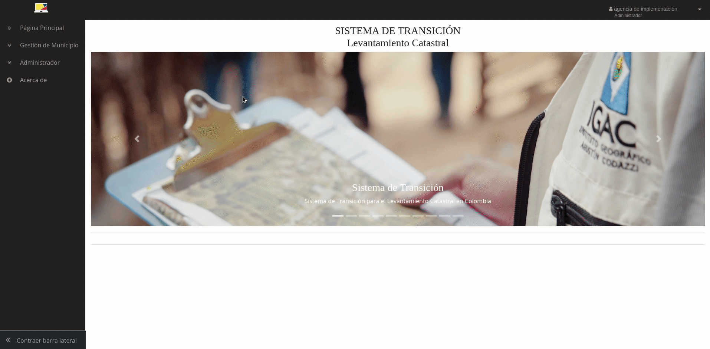

# Rol: Administrador Del Sistema

El administrador del sistema es el rol encargado de realizar principalmente la asignación de los municipios para iniciar la gestión catastral a los gestores habilitados, creación de entidades: gestores, operadores y proveedores de insumos; y usuarios de perfil “Administrador” de cada una las entidades.

A continuación, se describen cada uno de los módulos que tiene acceso este rol.

## Gestión de Usuarios

En este módulo el Administrador que está asociado a las funciones de la Autoridad Catastral ,puede listar y ver los datos de todos los usuarios del Sistema, crear entidades de tipo Gestor, Operador o Proveedor de Insumos (ver sección “[Administración de usuarios](https://swisstierrascolombia.github.io/st-docs/user-manual-doc/3-gestion-usuarios.html)“). Puede también registrar nuevos usuarios administradores de la entidad a través de un formulario, activarlos y desactivarlos y asociarlos a un rol Gestor, Operador o Proveedor de Insumos, a continuación la descripción de estas funcionalidades.

### Listar Usuarios

Se despliega al dar clic en menú lateral izquierdo en la entrada “Administrador/Listar Usuarios“ y el sistema lista todos los usuarios registrados en el sistema asociados a cada una de sus entidades con su rol, perfil y área de trabajo (si aplica) y sus datos adicionales como: usuario, nombres, apellidos, correo, fecha de creación del usuario y las opciones de editar, activar/desactivar el usuario como se muestra en la imagen.

## Registrar usuarios Administradores de entidad

Se despliega al dar clic en el menú lateral izquierdo en la entrada “Administrador/Registrar Usuarios“ en el formulario se diligencian los campos: Nombre, Apellido, nombre de usuario, correo electrónico que se asocia a la cuenta y al que le llegarán todas las notificaciones del Sistema así como la contraseña para ingresar como se ve en la imagen; en la parte inferior se muestran tres opciones para el tipo de entidad a la que se quiere asociar: Gestor, Operador, Proveedor, se debe escoger dependiendo a qué rol se desee asociar el usuario Administrador y luego escoger la entidad a la que pertenece de la lista de selección.

### Registrar usuario rol Gestor

En el formulario diligenciar los campos solicitados y en la parte inferior escoger la opción “Gestor“ y de la lista seleccionar la entidad a la que pertenece el usuario Administrador y dar clic en el botón “Registrar“

### Registrar usuario rol Operador

En el formulario diligenciar los campos solicitados y en la parte inferior escoger la opción “Operador“ y de la lista seleccionar la entidad a la que pertenece el usuario Administrador y dar clic en el botón “Registrar“

### Registrar usuario rol Proveedor de Insumos

En el formulario diligenciar los campos solicitados y en la parte inferior escoger la opción “Proveedor“ y de la lista seleccionar la entidad a la que pertenece el usuario Administrador y dar clic en el botón “Registrar“

## Creación de Entidades

En este módulo el administrador realiza el registro de las entidades asociadas a un rol específico como Gestor, Operador y Proveedor de Insumos.

### Registrar Gestor

Se da clic en el menú lateral izquierdo en la entrada “Administrador/Registrar Gestor“ y se diligencia el formulario en los campos: Nombre y NIT, este último valida su estructura numérica y cantidad de caracteres (xxxxxxx-y) como se muestra en la imagen y se clic en el botón “Crear“. En la parte inferior se muestra una lista con las entidades de Rol Gestor creadas, donde se puede editar dando clic en el icono de lápiz y “Activar/Desactivar“ dando clic en el selector lo cual permite activar o desactivar estas entidades en el Sistema.

### Registrar Operador

Se da clic en el menú lateral izquierdo en la entrada “Administrador/Registrar Operador“ en el formulario se diligencian los campos: Nombre, NIT y tipo que puede ser pública o privada como se muestra en la imagen. En la parte inferior se muestra una lista con las entidades de Rol Operador creadas, donde se puede editar dando clic en el icono de lápiz y “Activar/Desactivar“ dando clic en el selector lo cual permite activar o desactivar estas entidades en el Sistema.

### Registrar Proveedor de Insumos

Se da clic en el menú lateral izquierdo en la entrada “Administrador/Registrar Proveedor” en el formulario como se muestra en la imagen, se diligencian los campos: Nombre, NIT y categoría; este último tiene como opción tres categorías catastro, registro, tierras y general, se escoge dependiendo el tipo de información que el proveedor disponga en el Sistema, por defecto la interfaz selecciona la categoría “General“. En esta misma interfaz se listan las entidades con rol proveedor de insumos creados en el Sistema y tiene la opción de ser editadas, activar o desactivar estas entidades para que estén disponibles o no en el Sistema y eliminarlas permanentemente.

## Gestión de Municipio

En este módulo el administrador realiza la asignación de los municipios para iniciar el proceso de levantamiento catastral a cada uno de los gestores habilitados, el administrador deberá diligenciar un formulario después de seleccionar el municipio o municipios a asignar, determinando la fecha de inicio de la asignación y cargando los soportes en formato PDF de la asignación del municipio como se ve en la imagen. En esta misma interfaz después de haber asignado al gestor se habilita el cargue y entrega de la información base para la gestión catastral entregada por la Autoridad Catastral al Gestor. A continuación, se describen las actividades que el administrador puede realizar en este módulo.

### Asignación de Gestor

Se despliega al dar clic en el menú lateral izquierdo en la entrada “Gestión de Municipio/Asignación“ se selecciona el departamento y luego el municipio o municipios utilizando los selectores; se diligencian los datos y se carga el soporte correspondiente para la asignación al gestor y se da clic en el botón Asignar Gestor Catastral como se ve en la imagen.

### Disposición de información para la Gestión Catastral

Se despliega al dar clic en la cuarta pestaña del formulario de espacio de trabajo, en esta interfaz se agregan los recursos o archivos que la Autoridad Catastral defina hacer entrega al gestor para que inicie la gestión catastral del municipio asignado, se van agregando uno a uno los registros asignándole un nombre y diligenciando un campo de observación describiendo detalladamente la información a entregar, se escoge el tipo archivo a cargar del selector: Insumo, URL o FTP, Fuente Externa. Para el caso de Insumo debe cargar el archivo comprimido que no debe superar las 10 MB permitidas por el sistema en la caja que se activa para esta opción; para URL y FTP se debe colocar en la caja de texto la dirección completa y en caso de requerirse los datos de autenticación se deben registrar en el campo credenciales que aparece al seleccionar este tipo; para la opción Fuente Externa se debe cargar la evidencia de entrega en un archivo en formato PDF y si es más de un archivo que evidencie la entrega deben cargarse los PDF en un solo archivo comprimido que no tenga un tamaño mayor de 10 MB.

Después de disponer la información para la gestión catastral al Gestor se puede generar y descargar un reporte de entrega de la información en formato PDF como se muestra en la imagen.

