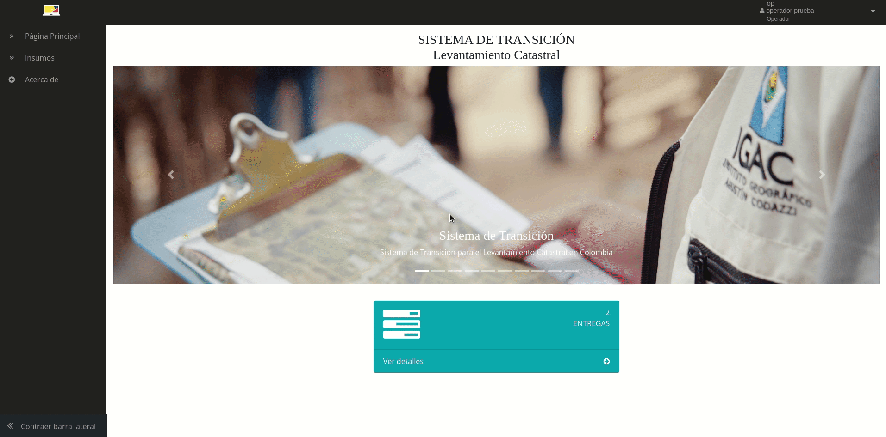
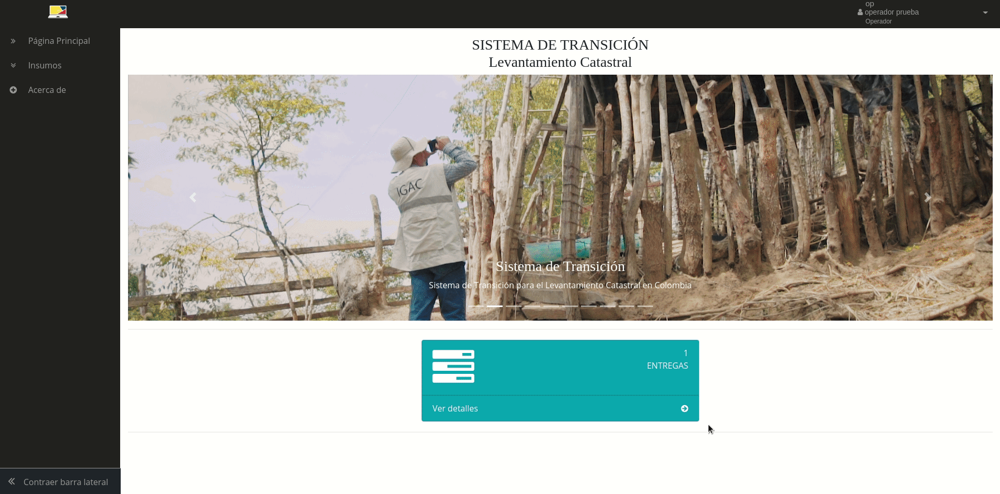
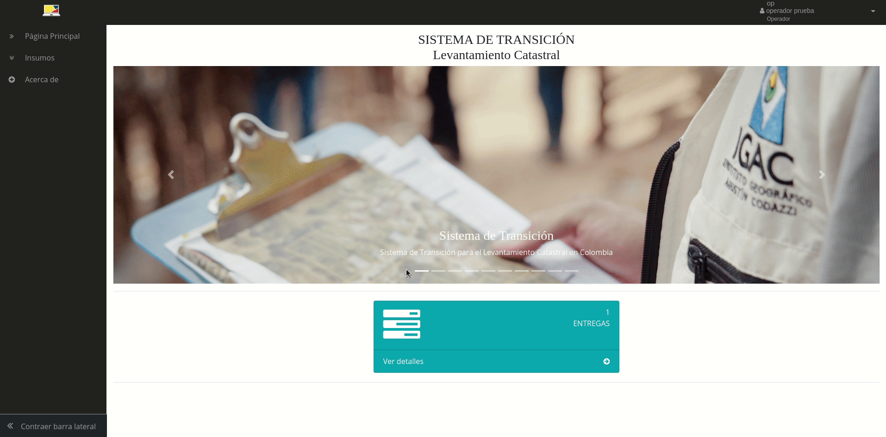
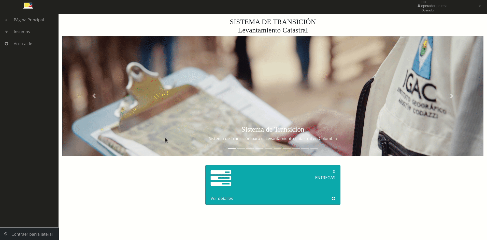
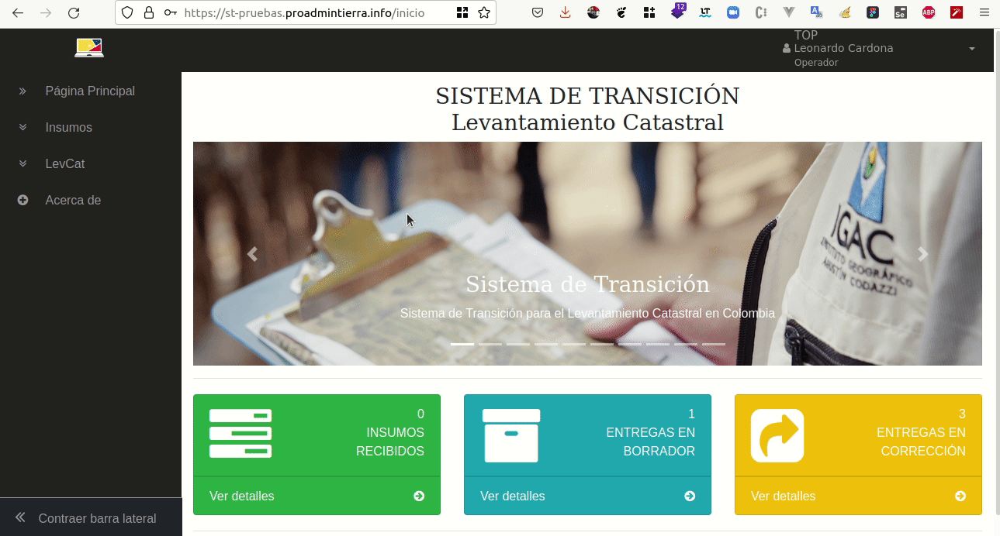
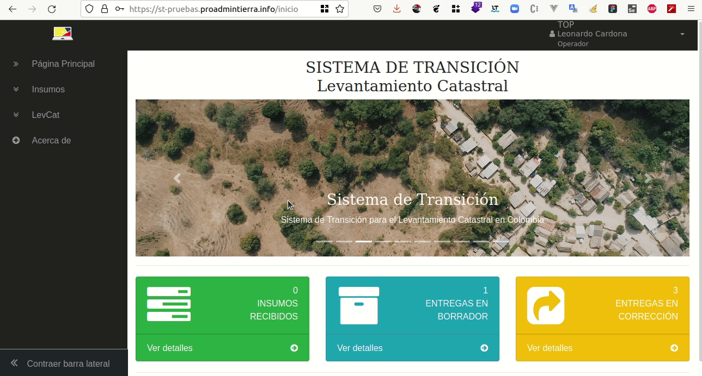
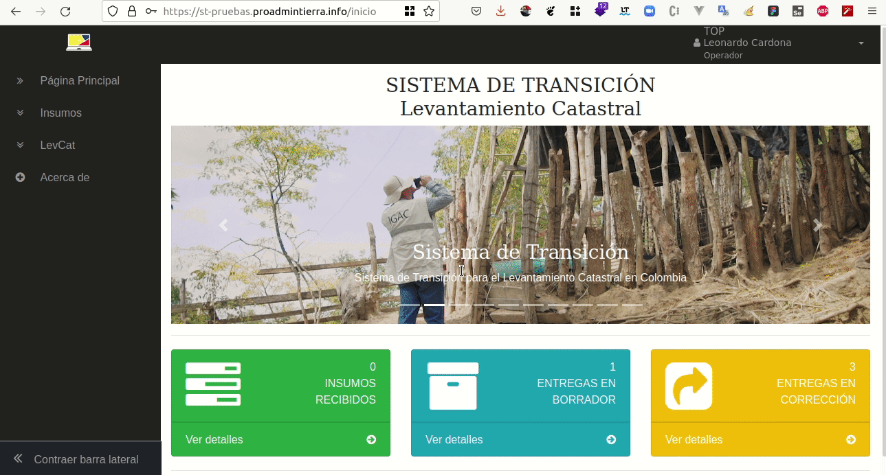
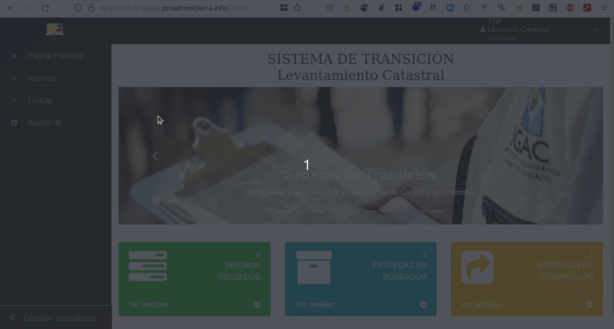
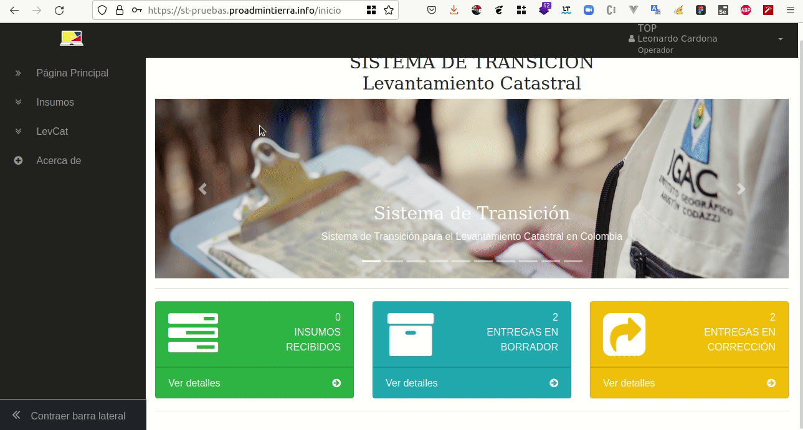
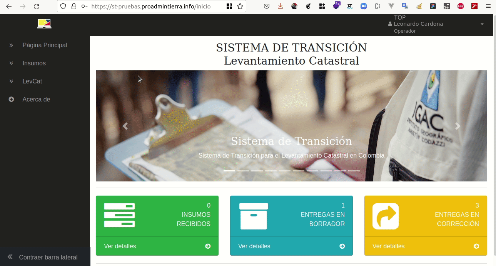

# Rol: Operador

El Operador es el rol encargado de realizar el levantamiento catastral de los municipios asignados, para esta versión del sistema tiene acceso solo al módulo de Insumos en donde puede realizar la descarga de los insumos que el Gestor dispone para iniciar el proceso de levantamiento catastral en los municipios contratados, la funcionalidad de crear usuarios asociados a su entidad no está disponible para esta versión el sistema.

A continuación, se describen cada uno de los módulos que tiene acceso este rol.
## Gestión de Insumos

En este módulo el Operador podrá realizar la descarga de los insumos que el Gestor le ha dispuesto en el Sistema para iniciar las actividades relacionadas al levantamiento catastral, así como la consulta y descarga del reporte de cada uno de los insumos recibidas y un reporte general de todos los insumos entregados por el Gestor. Para esta versión del Sistema, se tienen las siguientes funcionalidades disponibles: Descargas pendientes, Descarga de reporte y Descargas realizadas.
### Descargas pendientes

Se despliega al dar clic en el menú lateral izquierdo en la entrada “Insumos/Descargas pendientes“, la interfaz despliega una lista de las entregas realizadas por el Gestor, que pueden ser por cada municipio asignado o varias entregas para un mismo municipio. Esta lista tiene los siguientes campos: Identificador de la entrega, el nombre del Gestor que hace la entrega, nombre del municipio, código del municipio de los insumos entregados, fecha de entrega, campo de observaciones y el campo de opciones en donde al dar clic en el icono “Ver“ se da ingreso a la entrega como se ve en la imagen.

A continuación, el Operador podrá realizar la descarga de los insumos entregados.

Una vez terminada la descarga y confirmando que se tienen los insumos entregados por el Gestor, se procede a cerrar la entrega dando clic en la parte inferior de la lista al botón de “Cerrar entrega“ con el fin de mantener organizadas las descargas.

**Advertencia**: ¡Una vez se cierre la entrega ya no es posible volver a descargar los insumos!, por ello se debe asegurar la descarga de todos los insumos de la entrega antes de cerrarla; para el caso del reporte de entrega este estará disponible en la funcionalidad de “Descargas realizadas“.

**Sugerencia**: El operador puede dejar abierta cada una de las entregas y descargar los insumos más de una vez, pero en el caso de tener numerosas entregas por parte del Gestor puede llevar a presentarle confusión, por lo tanto, se sugiere cerrarla cuando esté seguro de haber descargado completamente todos los insumos y no necesite tenerla abierta.

### Descarga de reporte

Al ingresar al detalle de las entregas, en la parte superior derecha se encuentra el icono para la consulta y descarga del reporte general de la entrega; es importante indicar que, si se ingresa por primera vez a la entrega, los iconos de consulta de los reportes de descarga no están disponibles ya que estos solo se activan cuando el Operador realiza la descarga del insumo al dar clic en el icono “Descargar“ y cuando hace la descarga de todos los insumos el icono de reporte general se activa en la parte superior de la lista. Por otra parte, al ingresar por primera vez a esta lista la fecha de descarga aparece con una etiqueta “No se ha descargado el insumo“ y se actualiza una única vez con la fecha y hora en el momento de la descarga del insumo y con esto ya se puede consultar el reporte de descarga. Es de notar que la entrega sólo es posible cerrarla cuando el Operador ha hecho la descarga de todos los insumos de la entrega y con ello ya desaparece de la lista de “Descargas pendientes“ y pasa a lista de “Descargas realizadas“.

### Descargas realizadas

Se despliega al dar clic en el menú lateral izquierdo en la entrada “Insumos/Descargas realizadas“, la interfaz despliega una lista de las descargas de insumos realizadas por el Operador, que pueden ser por cada municipio asignado o varias entregas para un mismo municipio. Esta lista tiene los siguientes campos: Identificador de la descarga, el nombre del Gestor que hace la entrega, nombre del municipio, código del municipio, fecha de entrega, campo de observaciones y el campo de opciones en donde al dar clic en el icono “Ver“ se da ingreso a la interfaz de detalle de “Descargas realizadas“ como se ve en la imagen.

Una vez se ingrese a alguno de los registros se muestra el detalle en donde se tienen los datos generales de la descarga por parte del Operador y en la parte superior derecha se encuentra el icono para la consulta y descarga del reporte general de la entrega que se generó en el momento de cerrar el registro de la entrega; a continuación en la parte inferior se muestra un listado con los insumos descargados con los siguientes campos: nombre del insumo descargado, observaciones, fecha de descarga, nombre del usuario que realizó la descarga y su correo como se ve en la imagen. Esta interfaz sirve de apoyo al usuario para llevar un registro de las descargas de insumos realizadas.

## Entrega de productos "Levantamiento Catastral"

Ver Bandeja de entrada

Crear borrador de "Entrega" a Gestor

Eliminar borrador de "Entrega"

Actualizar borrador de "Entrega"

Ver tipos de "Entregas"

"Agregar productos" a la entrega

Adjuntar archivos a un "Producto"

Adjuntar y validar archivos XTF

Adjuntar un recurso FTP

Realizar una entrega al Gestor

Corregir y realizar entrega

Ver entregas finalizadas y uso de filtros

